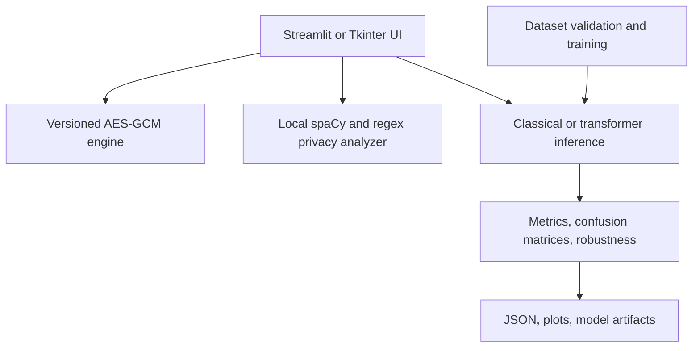

# CipherSense AI architecture

```mermaid
flowchart TD
  UI[Streamlit or Tkinter UI] --> CRYPTO[Versioned AES-GCM engine]
  UI --> NLP[Local spaCy and regex privacy analyzer]
  UI --> INF[Classical or transformer inference]
  TRAIN[Dataset validation and training] --> INF
  INF --> EVAL[Metrics, confusion matrices, robustness]
  EVAL --> ART[JSON, plots, model artifacts]
```

Plaintext stays in-process by default. Passwords are used only to derive an ephemeral encryption key.
